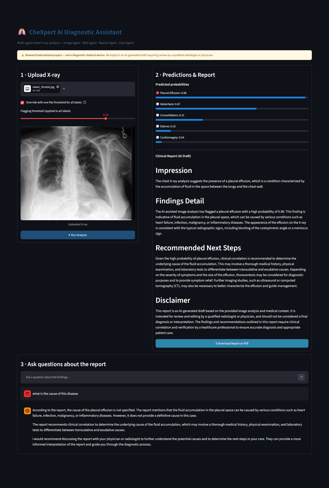

# CheXpert Multi-Agent Diagnostic Assistant

An end-to-end multi-agent system that takes a chest X-ray, predicts diseases,
retrieves relevant medical knowledge, generates a clinical-style report, and
lets the user chat about the findings — with a downloadable PDF report.



## Dataset & Paper

- **Dataset (Kaggle mirror used in this project):** [ashery/chexpert](https://www.kaggle.com/datasets/ashery/chexpert)
- **Original dataset (Stanford AIMI):** [CheXpert: Chest X-rays](https://aimi.stanford.edu/datasets/chexpert-chest-x-rays) — DOI: [10.71718/y7pj-4v93](https://doi.org/10.71718/y7pj-4v93)
- **Original paper:** Irvin, J., Rajpurkar, P., et al. (2019). *CheXpert: A Large Chest Radiograph Dataset with Uncertainty Labels and Expert Comparison.* AAAI 2019. [arXiv:1901.07031](https://arxiv.org/abs/1901.07031)

```bibtex
@inproceedings{irvin2019chexpert,
  title={CheXpert: A Large Chest Radiograph Dataset with Uncertainty Labels and Expert Comparison},
  author={Irvin, Jeremy and Rajpurkar, Pranav and Ko, Michael and Yu, Yifan and Ciurea-Ilcus, Silviana and Chute, Chris and Marklund, Henrik and Haghgoo, Behzad and Ball, Robyn and Shpanskaya, Katie and others},
  booktitle={Proceedings of the AAAI Conference on Artificial Intelligence},
  volume={33},
  pages={590--597},
  year={2019}
}
```

## Architecture

```
User Uploads X-ray
      ↓
 Image Agent          → multi-label disease classifier (DenseNet121)
      ↓
 Disease Prediction    → probabilities for 5 CheXpert conditions
      ↓
 RAG Agent             → retrieves relevant medical knowledge (FAISS + embeddings)
      ↓
 Medical Knowledge     → disease descriptions, typical findings, follow-up
      ↓
 Report Agent          → LLM turns predictions + knowledge into a report
      ↓
 Clinical Report        → downloadable as PDF
      ↓
 Chat Agent             → Q&A grounded in the report + knowledge base
```

## Results

The Image Agent (DenseNet121) was trained on Kaggle (T4 GPU, free tier —
local training on a 4GB laptop GPU was too slow to complete in a reasonable
time) using a **patient-level train/test split** to prevent data leakage, a
**per-label uncertain-label policy** (informed by the original CheXpert
paper's findings), and **class-imbalance-aware loss weighting**. Final
metrics were computed on a genuine held-out test set (28,300 images, 9,681
patients) that was never used during training or threshold selection.

| Condition | AUROC | Precision | Recall | F1 |
|---|---|---|---|---|
| Pleural Effusion | 0.863 | 73.9% | 79.6% | 0.766 |
| Cardiomegaly | 0.851 | 27.5% | 85.0% | 0.416 |
| Edema | 0.845 | 61.0% | 74.6% | 0.671 |
| Consolidation | 0.726 | 12.7% | 59.0% | 0.210 |
| Atelectasis | 0.706 | 45.1% | 63.6% | 0.528 |

**Mean AUROC: 0.798** — comparable to published single-model CheXpert
baselines. Cardiomegaly and Consolidation have low precision by design: the
loss function was weighted to favor recall (catching more true positives)
over precision for these rarer conditions, consistent with a screening-tool
use case where a false alarm is preferable to a missed finding. Per-label
decision thresholds (rather than one flat 0.5 cutoff) were chosen via
F1-optimal search on the validation set, since different conditions have
very different optimal operating points.

**Limitations:** trained on a subset of the full ~223k-image CheXpert
training set due to compute constraints; restricted to 5 of the original 14
CheXpert conditions (the "competition labels" most commonly benchmarked in
the literature); Cardiomegaly/Consolidation precision is intentionally
traded off for recall. This is a research/educational project, not a
validated diagnostic tool.

## 1. File structure

```
CheXpert_Project/
├── assets/
│   └── app_screenshot.png
├── data/
│   ├── load.py                   # downloads dataset via kagglehub
│   ├── train.csv
│   ├── valid.csv
│   └── test_images/                 # actual images
├── notebooks/
│   └── chest-image-agent_train_on_kaggle.ipynb   # Kaggle training notebook (source of truth for the trained model)
├── checkpoints/
│   ├── image_agent.pt            # trained Image Agent weights
│   └── thresholds.json           # per-label F1-optimal decision thresholds
├── src/
│   ├── config.py                 # paths, labels, hyperparameters, Groq settings
│   ├── preprocessing/
│   │   └── dataset.py            # PyTorch Dataset + transforms
│   ├── models/
│   │   └── image_agent.py        # DenseNet121 multi-label model (with dropout)
│   ├── inference/
│   │   └── predict.py            # Image Agent wrapper, per-label thresholds
│   ├── knowledge/
│   │   ├── knowledge_base.json   # curated medical knowledge per condition
│   │   └── rag_agent.py          # embeds + retrieves knowledge (RAG Agent)
│   ├── report/
│   │   ├── report_agent.py       # generates the clinical report (Report Agent, via Groq)
│   │   └── pdf_generator.py      # renders the report as a downloadable PDF
│   ├── chat/
│   │   └── chat_agent.py         # Q&A over the report + knowledge (Chat Agent, via Groq)
│   ├── evaluation/
│   │   ├── test_image_agent.py   # standalone Image Agent evaluation
│   │   ├── test_report_agent.py  # standalone Report Agent test
│   │   └── test_chat_agent.py    # standalone Chat Agent test
│   ├── pipeline.py               # wires all agents together end-to-end
│   └── app.py                    # Streamlit UI: upload -> report -> chat -> PDF
├── requirements.txt
└── README.md
```

## 2. Setup steps

1. **Download the dataset** via `data/load.py` (uses `kagglehub`).

2. **Create a virtual environment** and install dependencies:
   ```bash
   cd CheXpert_Project
   python -m venv venv
   venv\Scripts\Activate.ps1       # Windows PowerShell
   pip install -r requirements.txt
   ```

3. **Get a free Groq API key** (powers the Report Agent and Chat Agent) at
   https://console.groq.com/keys — no credit card required. Set it:
   ```powershell
   $env:GROQ_API_KEY="gsk_your-key-here"
   ```
   (Set it permanently via Windows Environment Variables so it persists
   across terminal sessions.)

4. **Place the trained checkpoint.** The Image Agent was trained on Kaggle
   (see `notebooks/chest-image-agent.ipynb`). Download `image_agent_best.pt`
   and `thresholds.json` from the Kaggle output and place them in
   `checkpoints/` (rename the model file to `image_agent.pt`).

5. **Test each agent in isolation** (recommended before running the full pipeline):
   ```powershell
   python -m src.evaluation.test_image_agent
   python -m src.evaluation.test_report_agent
   python -m src.evaluation.test_chat_agent
   ```

6. **Run the full pipeline on one image**:
   ```powershell
   python -m src.pipeline --image "data\chexpert\valid\patient64541\study1\view1_frontal.jpg"
   ```

7. **Run the interactive app**:
   ```powershell
   streamlit run src/app.py
   ```

## 3. Important disclaimer

This is a student/portfolio project, **not a diagnostic medical device**.
CheXpert labels are extracted from radiology reports via NLP and contain
uncertainty labels; the model is a research baseline. All generated reports
explicitly state they are AI-drafted and require review by a qualified
radiologist before any clinical use.
